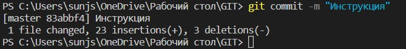

```bash
PS C:\Users\sunjs\OneDrive\Рабочий стол\GIT> git log --graph
*   commit 7f8f833ab922e81dca7609d27a05a2efb911a338 (HEAD -> master)
|\  Merge: 817037e c59ad59
| | Author: Julia Nikolaeva <sunjshu@gmail.com>
| | Date:   Sun Jul 31 14:28:03 2022 +0300
| |
| |     Merge branch 'branch4'
| |
| * commit c59ad59be6b101cbd32d2e8f268defb10fccecd3 (branch4)
| | Author: Julia Nikolaeva <sunjshu@gmail.com>
| | Date:   Sun Jul 31 14:10:53 2022 +0300
| |
| |     Modify Branch4
| |
* |   commit 817037e71a32b0a1fedac02f7a8b9d2a68f16a4c
|\ \  Merge: f940bc9 565bb1d
| | | Author: Julia Nikolaeva <sunjshu@gmail.com>
| | | Date:   Sun Jul 31 14:22:11 2022 +0300
| | |
| | |     Merge branch 'branch3'
| | |
| * | commit 565bb1daee963ab51ef06a2ddaf7f671db180958 (branch3)
| |/  Author: Julia Nikolaeva <sunjshu@gmail.com>
| |   Date:   Sun Jul 31 14:19:25 2022 +0300
| |
| |       Modify Branch3
| |
* |   commit f940bc9ace464d65ba420c7853d7b0b6f87df7e9
|\ \  Merge: b2cbc46 36752c9
| | | Author: Julia Nikolaeva <sunjshu@gmail.com>
| | | Date:   Sun Jul 31 14:22:06 2022 +0300
| | |
| | |     Merge branch 'branch2'
| | |
| * | commit 36752c90dcddf14dd4e776e8a35790cfd1bd6286 (branch2)
| |/  Author: Julia Nikolaeva <sunjshu@gmail.com>
| |   Date:   Sun Jul 31 14:17:03 2022 +0300
| |
| |       Modify Branch2
| |
* | commit b2cbc466db92380431397d39947d77f37a6f441b (branch1)
|/  Author: Julia Nikolaeva <sunjshu@gmail.com>
|   Date:   Sun Jul 31 14:13:59 2022 +0300
|
|       Modify Branch1
|
* | commit b2cbc466db92380431397d39947d77f37a6f441b (branch1)
|/  Author: Julia Nikolaeva <sunjshu@gmail.com>
|   Date:   Sun Jul 31 14:13:59 2022 +0300
|
|       Modify Branch1
|
* commit 0e20e336fdb3cead8c7c28dcbfac98ba19b36eeb
| Author: Julia Nikolaeva <sunjshu@gmail.com>
| Date:   Sun Jul 31 13:12:56 2022 +0300
|
|     ИНструкция 3
|
* commit 96e359f0475c7dc5469a3ab4d2ea6449f9e15dce
| Author: Julia Nikolaeva <sunjshu@gmail.com>
| Date:   Sun Jul 31 12:59:48 2022 +0300
|
|     Инструкция 2
|
* commit 83abbf412f85a8bf1de64cc527d04f2af02fc67c
| Author: Julia Nikolaeva <sunjshu@gmail.com>
| Date:   Sun Jul 31 12:52:11 2022 +0300
|
|     Инструкция
|
* commit 16ae6ebcf575d3185a64ef01bfc9619f2108a079
| Author: Julia Nikolaeva <sunjshu@gmail.com>
| Date:   Sun Jul 31 12:39:07 2022 +0300
|
|     Инрукция
|
* commit b1a0861e8bac7aa9422aed31dadb9a26e5ba50a5
| Author: Julia Nikolaeva <sunjshu@gmail.com>
| Date:   Thu Jul 28 13:35:20 2022 +0300
|
|     жирный курсив
| |
* |   commit f940bc9ace464d65ba420c7853d7b0b6f87df7e9
|\ \  Merge: b2cbc46 36752c9
| | | Author: Julia Nikolaeva <sunjshu@gmail.com>
| | | Date:   Sun Jul 31 14:22:06 2022 +0300
| | |
| | |     Merge branch 'branch2'
| | |
| * | commit 36752c90dcddf14dd4e776e8a35790cfd1bd6286 (branch2)
| |/  Author: Julia Nikolaeva <sunjshu@gmail.com>
| |   Date:   Sun Jul 31 14:17:03 2022 +0300
|\  Merge: 817037e c59ad59
| | Author: Julia Nikolaeva <sunjshu@gmail.com>
| | Date:   Sun Jul 31 14:28:03 2022 +0300
| |
| |     Merge branch 'branch4'
| |
| * commit c59ad59be6b101cbd32d2e8f268defb10fccecd3 (branch4)
| | Author: Julia Nikolaeva <sunjshu@gmail.com>
| |
| |     Modify Branch4
```


```bash
PS C:\Users\sunjs\OneDrive\Рабочий стол\GIT> cat README.md
# Инструкция 4


> Вы установили себе Git и можете им пользоваться. Давайте теперь его настроим, чтобы когда вы создавали commit, указывался автор, кто его создал.

> Открываем терминал (Linux и MacOS) или консоль (Windows) и вводим следующие команды.
>
> #Установим имя для вашего пользователя
>
> #Вместо <ваше_имя> можно ввести имя
>
> #Кавычки оставляем
>
```
git config --global user.name "<ваше_имя>"
```

> #Теперь установим email. Принцип тот же.
```
git config --global user.email "<адрес_почты@email.com>"
```

## git init
команда ``git init`` создает\инициализурет репозиторий

## git add
команда ``git add .`` или ``git add --all`` - добавляет все файлы в репозиторий

``git add <имя файла>`` добавляет в репозиторий конкретный файл
Важно указывать то, что нужн добалять, просто add нельзя
## git сommit

команда ``git commit -m "<комментарий>"``  создает коммит



> Чаще всего их создают, когда:
> - Создан новый функционал
> - Добавлен новый блок на верстке
> - Исправлены ошибки по коду
> - Вы завершили рабочий день и хотите сохранить код


## git status

команда ``git status``  показывает:
- на какой мы ветке
- изменения в файлах
- неотслеживаемые изменения и файлы
```
git status
```
## git log

команда ``git log``  показывает историю ветки
```
git log
```
[подробнее можно почитать по этой ссылке](https://habr.com/ru/post/541258/)

[и по этой](https://habr.com/ru/post/542616/)

git checkout
PS C:\Users\sunjs\OneDrive\Рабочий стол\GIT>


```


```bash
PS C:\Users\sunjs\OneDrive\Рабочий стол\GIT> history

  Id CommandLine
  -- -----------
   1 git status
   2 git add .
   3 git status
   4 cat README.md
   5 chcp 65001
   6 cat README.md
   7 chcp 866
   8 cat README.md
   9 chcp 1271
  10 chcp 1251
  11 cat README.md
  12 chcp 65001
  13 cat README.md
  14 chcp 1252
  15 cat README.md
  16 cat README.md
  17 git add .
  18 chcp 65001
  19 chcp 1251
  20 chcp 866
  21 git commit -m "Инрукция"
  22 git status
  23 git add .
  24 git commit - m "Инструкция"
  25 git commit -m "Инструкция"
  26 git add .
  27 git commit -m "Инструкция 2"
  28 git status
  29 git log
  30 cat README.md
  31 git add .
  32 git commit -m "ИНструкция 3"
  33 git branch branch1
  34 git checkout branch1
  35 git branch
  36 git checkout -b branch2
  37 git checkout -b branch3
  38 git checkout -b branch4
  39 git add .
  40 git commit -m "Modify Branch4"
  41 git checkout branch1
  42 git add .
  43 git commit -m "Modify Branch1"
  44 git checkout -b branch2
  45 git checkout branch2
  46 git add .
  47 git commit -m "Modify Branch2"
  48 git checkout branch3
  49 git add .
  50 git commit -m "Modify Branch3"
  51 git checkout master
  52 git merge branch1
  53 git merge branch2
  54 git merge branch3
  55 git merge branch4
  56 git log --graph
  57 git log --graph | graph.md
  58 git log --graph | touch graph.md
  59 git add .
  60 git commit -m "graph"
  61 git checkout branch1
  62 git status
  63 git add .
  64 git commit -m "Добавили к инструкции 1"
  65 git checkout branch2
  66 git add .
  67 git commit -m "Добавили к инструкции 2"
  68 git checkout branch3
  69 git add .
  70 git commit -m "Добавили к инструкции 3"
  71 git checkout branch4
  72 git add .
  73 git commit -m "Добавили к инструкции 4"
  74 git checkout master
  75 git merge branch1
  76 git merge branch2
  77 git add .
  78 git commit -m 'merge branch2 into master'
  79 git merge branch3
  80 git add .
  81 git commit -m 'merge branch3 into master'
  82 git merge branch4
  83 git add .
  84 git commit -m 'merge branch4 into master'
  85 cat README.md
  86 git add .
  87 git commit -m 'graph.md'
  88 git history


PS C:\Users\sunjs\OneDrive\Рабочий стол\GIT>
```
